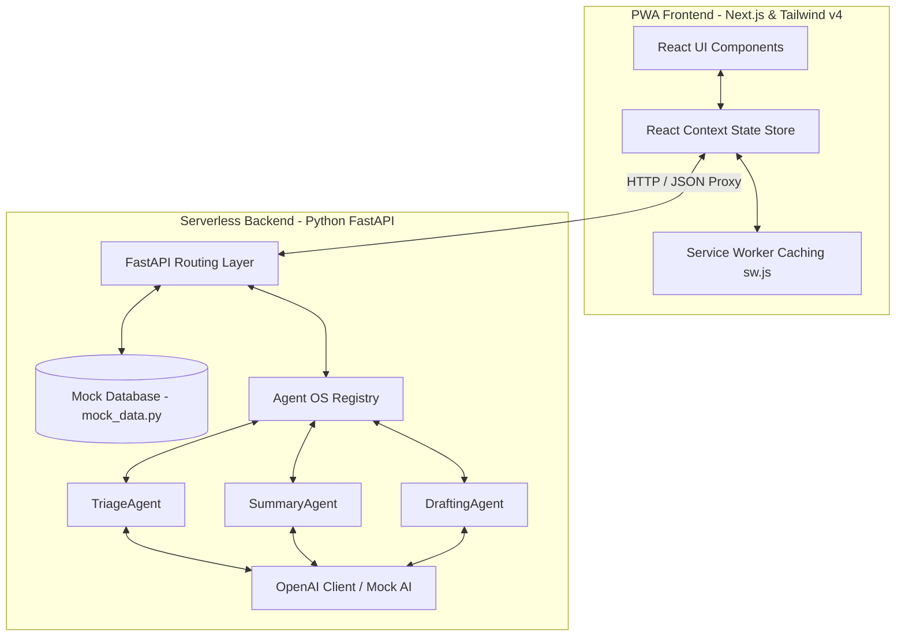

# AuraMail Architectural Design

This document details the software architecture, data flow, and components of the AuraMail AI-first PWA email client.

## System Components

### 1. PWA Frontend (Next.js 16 + React 19)
- **State Store (`store.tsx`)**: Centralizes account selection, unified inbox sorting, folder updates, active email viewing, and AI dispatch loadings.
- **Service Worker (`sw.js`)**: Caches essential HTML shell, JS bundles, and styles for offline launch. Intercepts fetch requests to serve cached details when disconnected.
- **Tailwind v4 Styling**: Custom typography variables (Outfit & Inter fonts) and glassmorphism templates configured directly in the CSS stylesheet.

### 2. Backend API Layer (FastAPI)
Exposed serverless routes mounted under `/api` in `api/index.py`:
- `GET /api/emails/accounts`: Fetches all accounts.
- `GET /api/emails`: Retrieves unified lists, filters folder states, and matches query terms.
- `POST /api/emails/folder`: Updates destination folders (Archive, Delete).
- `POST /api/ai/prioritize`: Evaluates email metadata to classify urgency levels.
- `POST /api/ai/summarize`: Compiles message bodies into bullet-point text.
- `POST /api/ai/draft-reply`: Generates email response templates matching requested tones.

### 3. Agent OS Engine (Python)
- Core orchestration structure defined in [api/agents/agent_os.py](file:///d:/Ank/atg/email-client/api/agents/agent_os.py).
- Registers skills (`call_openai`) and maps them to specialized agents.
- Implements event triggers. For example, triggering `"on_email_received"` activates the `TriageAgent` to automatically categorize message urgency.

### 4. Data Flow (Triage Example)
1. User receives a new email.
2. The system triggers the `"on_email_received"` event callback hook.
3. `TriageAgent` executes, calling the `call_openai` skill to grade body content and sender headers.
4. OpenAI returns a JSON containing `{ "priority": "high", "reason": "..." }`.
5. The `TriageAgent` writes these details directly back to the database record.
6. The frontend store refetches the inbox feed, displaying the glowing urgency tag.
