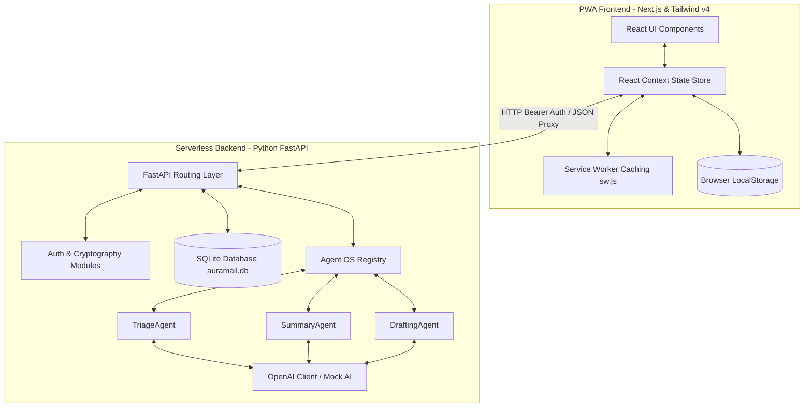
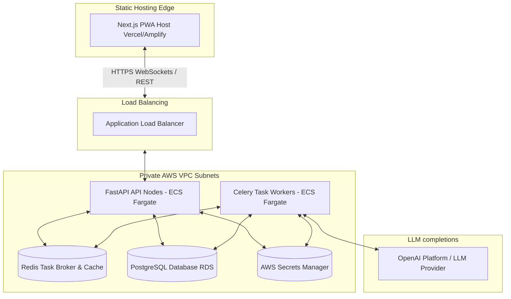

# AuraMail Architectural Design

This document details the software architecture, data flow, and components of the AuraMail AI-first PWA email client under local development and production environments.

---

## 1. Local Development Architecture

The development stack runs Next.js and FastAPI concurrently or inside local Docker containers. State caching in local storage is used to bridge database resets on serverless runs.

### Local Development System Components

*   **PWA Frontend (Next.js 16 + React 19)**:
    *   **State Store (`store.tsx`)**: Centralizes authenticated sessions, active accounts selection (including unified inbox routing), custom folder lists, and AI summarization drafts. Memoized using React `useCallback` to prevent infinite rendering cycles.
    *   **Session Caching**: Caches connected account metadata in browser `LocalStorage` to automatically heal SQLite database resets in ephemeral container runtimes.
    *   **Service Worker (`sw.js`)**: Caches static assets, stylesheets, and compiled JS bundles to enable offline PWA launches.
    *   **Active Tab Polling**: Syncs active email accounts every 2 minutes via a React visibility hook only when the browser tab is focused (`document.visibilityState === 'visible'`), conserving API call credits.
*   **Backend Security & Cryptography (`api/auth.py`)**:
    *   **Credential Protection**: Uses `cryptography.fernet` AES-256 keys to encrypt and decrypt third-party IMAP passwords before database persistence.
    *   **User Passwords**: Securely hashes user credentials using `bcrypt` during registration and signs sessions using JWT tokens.
    *   **SSL Context Bypass**: Configures custom SSL connections to bypass Python handshake validation failures in local developer environment certificate stores.
*   **Backend API Layer (FastAPI)**:
    *   Exposes routes under `/api` in `api/index.py` for account management, email feeds, folders, triaging, and dynamic reply generations.
*   **Agent OS Engine (Python)**:
    *   Orchestration layer located in `api/agents/agent_os.py` which maps agent roles to LLM completions via the `call_openai` skill.

---

## 2. Production Target Architecture

For high-volume production deployments, the frontend and backend are decoupled. Synchronous mail checks are moved to a Celery/Redis background task queue, and SQLite is migrated to a secure PostgreSQL database.

### Production Component Roles

1.  **Frontend PWA Hosting (Vercel / AWS Amplify)**:
    *   Hosts the Next.js app with full Server-Side Rendering (SSR) support.
    *   Deploys global Edge caches for PWA static files, fonts, and assets.
2.  **API Load Balancing & Routing (Application Load Balancer / API Gateway)**:
    *   SSL termination and request routing across a auto-scaled fleet of FastAPI backend instances in private subnets.
3.  **FastAPI Backend (AWS ECS Fargate)**:
    *   Serves lightweight REST endpoints. 
    *   Offloads heavy computations and long-running sync requests immediately to Redis as background tasks, returning an instant `202 Accepted` response.
4.  **Asynchronous Sync Queue (Celery & Redis)**:
    *   **Redis**: Serves as a fast, in-memory message broker for Celery tasks, and caches LLM response hashes.
    *   **Celery Workers**: Perform background IMAP syncing, Sent folder parsing, and auto-triaging updates asynchronously, preventing HTTP timeouts.
5.  **Relational Database (AWS RDS PostgreSQL + pgBouncer)**:
    *   Replaces SQLite to enable multi-tenant transactions and concurrent write lock processing.
    *   **pgBouncer** pools connections to prevent serverless FastAPI instances from overwhelming the database.
6.  **Secrets Management (AWS Secrets Manager / Vercel Secrets)**:
    *   Injects AES encryption keys and JWT token secrets at runtime, removing plaintext `.env` configurations from the repository.
7.  **Sanitization Middleware**:
    *   Backend sanitizer (using `bleach`) strips tracking pixels, script anchors, and external stylesheet references from email HTML bodies before database storage.
