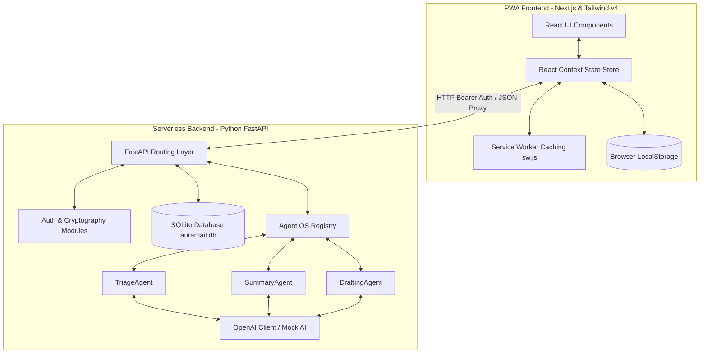

# AuraMail Architectural Design

This document details the software architecture, data flow, and components of the AuraMail AI-first PWA email client.

## System Components

### 1. PWA Frontend (Next.js 16 + React 19)
- **State Store (`store.tsx`)**: Centralizes authenticated sessions, active accounts selection (including unified inbox routing), custom folder lists, and AI summarization drafts. Memoized using React `useCallback` to prevent infinite rendering cycles.
- **Session Persistence**: Caches connected account configurations in browser `LocalStorage` to automatically heal serverless SQLite ephemeral container database resets on page reload.
- **Service Worker (`sw.js`)**: Caches Next.js HTML layouts, compiled JS bundles, and public fonts to enable offline application launch.
- **Tailwind v4 Styling**: Dynamic CSS configurations (Outfit and Inter Google Fonts, glassmorphism cards, slide drawer transitions) declared directly in the styling sheet.
- **Active Tab Polling**: Syncs active email accounts every 2 minutes via a React visibility hook only when the browser tab is focused (`document.visibilityState === 'visible'`), conserving API call credits.

### 2. Backend Security & Cryptography (api/auth.py)
- **Credential Protection**: Uses `cryptography.fernet` AES-256 keys to encrypt and decrypt third-party IMAP passwords before storing them in SQLite.
- **User Passwords**: Securely hashes user passwords using `bcrypt` during registration and authenticates sessions via JWT tokens.
- **SSL Context Bypass**: Configured custom SSL connections ignoring verification blocks to prevent python handshake certificate validation issues in local dev environments.

### 3. Backend API Layer (FastAPI)
Exposed routes mounted under `/api` in `api/index.py`:
- `GET/POST /api/emails/accounts`: Fetches or adds verified email accounts (supporting custom `imap_host` and `imap_port` parameters).
- `GET /api/emails`: Retrieves unified feed lists, filters folders (Inbox, Sent, Archive, Trash), and executes searches.
- `POST /api/emails/folder`: Updates destination folders.
- `POST /api/emails/{account_id}/sync`: Triggers delta IMAP/Sent folder mail checks (breaks immediately on duplicate record detections to minimize networks).
- `POST /api/ai/smart-suggestions`: Generates context-aware smart response suggestion pills.
- `POST /api/ai/summarize` / `/prioritize` / `/draft-reply`: Piped to the Agent OS.

### 4. Agent OS Engine (Python)
- Orchestration layer located in [api/agents/agent_os.py](file:///d:/Ank/atg/email-client/api/agents/agent_os.py).
- Maps specialized email handlers to LLM completions via the `call_openai` skill.
- Handles default simulated templates when `OPENAI_API_KEY` is not present.
- Executes automatic triage grading during email sync hooks.
